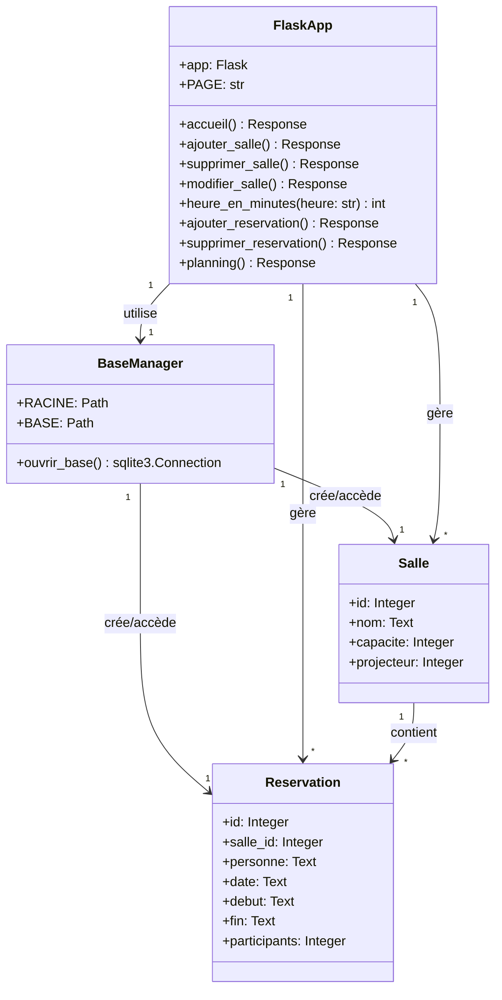

```mermaid
classDiagram
class Salle {
+id: Integer
+nom: Text
+capacite: Integer
+projecteur: Integer
}

    class Reservation {
        +id: Integer
        +salle_id: Integer
        +personne: Text
        +date: Text
        +debut: Text
        +fin: Text
        +participants: Integer
    }

    class BaseManager {
        +RACINE: Path
        +BASE: Path
        +ouvrir_base() sqlite3.Connection
    }

    class FlaskApp {
        +app: Flask
        +PAGE: str
        +accueil() Response
        +ajouter_salle() Response
        +supprimer_salle() Response
        +modifier_salle() Response
        +heure_en_minutes(heure: str) int
        +ajouter_reservation() Response
        +supprimer_reservation() Response
        +planning() Response
    }

    BaseManager "1" --> "1" Salle : crée/accède
    BaseManager "1" --> "1" Reservation : crée/accède
    FlaskApp "1" --> "1" BaseManager : utilise
    FlaskApp "1" --> "*" Salle : gère
    FlaskApp "1" --> "*" Reservation : gère
    Salle "1" --> "*" Reservation : contient

```
