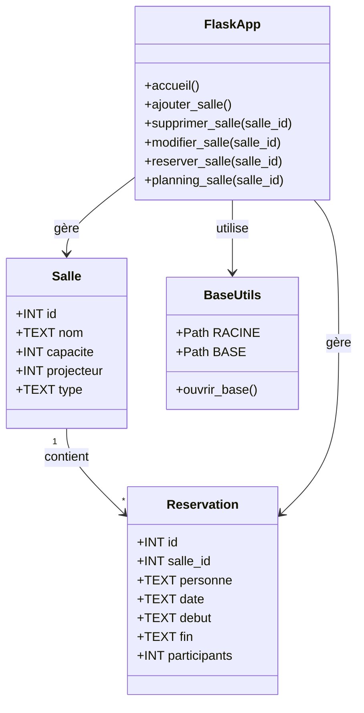

```mermaid
classDiagram
    class Salle {
        +INT id
        +TEXT nom
        +INT capacite
        +INT projecteur
        +TEXT type
    }

    class Reservation {
        +INT id
        +INT salle_id
        +TEXT personne
        +TEXT date
        +TEXT debut
        +TEXT fin
        +INT participants
    }

    class FlaskApp {
        +accueil()
        +ajouter_salle()
        +supprimer_salle(salle_id)
        +modifier_salle(salle_id)
        +reserver_salle(salle_id)
        +planning_salle(salle_id)
    }

    class BaseUtils {
        +Path RACINE
        +Path BASE
        +ouvrir_base()
    }

    Salle "1" --> "*" Reservation : contient
    FlaskApp --> BaseUtils : utilise
    FlaskApp --> Salle : gère
    FlaskApp --> Reservation : gère
```
